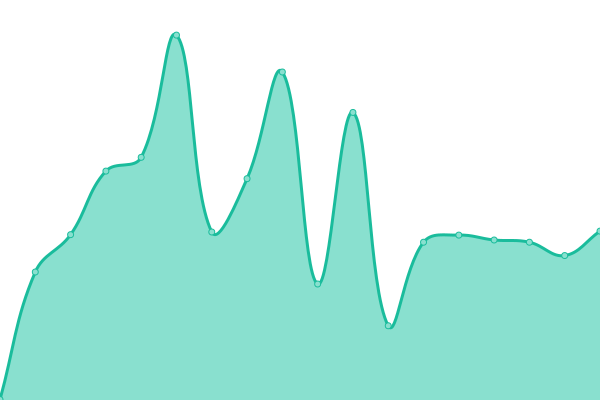
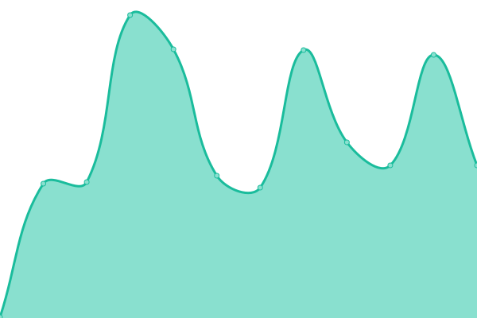
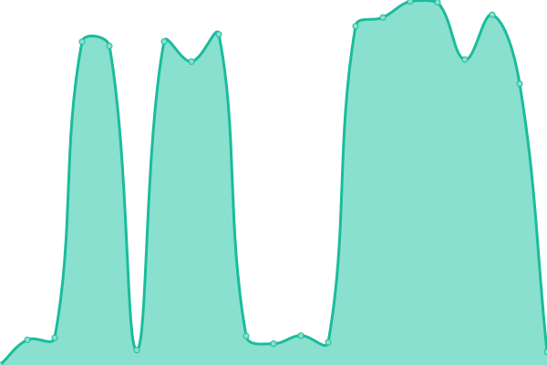

# [📈 Live Status](https://shockbs.github.io/status): <!--live status--> **🟧 Partial outage**

This repository contains the open-source uptime monitor and status page for [shockbs](https://shockbs.github.io/status), powered by [Upptime](https://github.com/upptime/upptime).

With [Upptime](https://upptime.js.org), you can get your own unlimited and free uptime monitor and status page, powered entirely by a GitHub repository. We use [Issues](https://github.com/shockbs/status/issues) as incident reports, [Actions](https://github.com/shockbs/status/actions) as uptime monitors, and [Pages](https://shockbs.github.io/status) for the status page.

<!--start: status pages-->
<!-- This summary is generated by Upptime (https://github.com/upptime/upptime) -->
<!-- Do not edit this manually, your changes will be overwritten -->
<!-- prettier-ignore -->
| URL | Status | History | Response Time | Uptime |
| --- | ------ | ------- | ------------- | ------ |
|  [Shock BS Portfolio](https://shockbs.is-a.dev) | 🟩 Up | [shock-bs-portfolio.yml](https://github.com/shockbs/status/commits/HEAD/history/shock-bs-portfolio.yml) | 

 715ms
     
 | 

<a href="https://status.shockbs.is-a.dev/history/shock-bs-portfolio">91.76%</a>
    

|  [Shock API](https://api.shockbs.is-a.dev) | 🟩 Up | [shock-api.yml](https://github.com/shockbs/status/commits/HEAD/history/shock-api.yml) | 

 337ms
     
 | 

<a href="https://status.shockbs.is-a.dev/history/shock-api">91.79%</a>
    

|  [Shock Storage](https://gg.shockbs.is-a.dev) | 🟥 Down | [shock-storage.yml](https://github.com/shockbs/status/commits/HEAD/history/shock-storage.yml) | 

 4708ms
     
 | 

<a href="https://status.shockbs.is-a.dev/history/shock-storage">96.94%</a>
    

<!--end: status pages-->

[**Visit our status website →**](https://shockbs.github.io/status)

## 📄 License

- Powered by: [Upptime](https://github.com/upptime/upptime)
- Code: [MIT](./LICENSE) © [Anand Chowdhary](https://anandchowdhary.com), supported by [Pabio](https://pabio.com)
- Data in the `./history` directory: [Open Database License](https://opendatacommons.org/licenses/odbl/1-0/)
